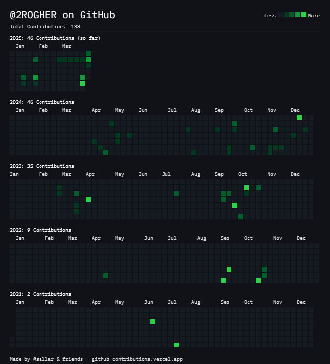

<!--
**2ROGHER/2ROGHER** is a ✨ _special_ ✨ repository because its `README.md` (this file) appears on your GitHub profile.

Here are some ideas to get you started:

- 🔭 I’m currently working on ...
- 🌱 I’m currently learning ...
- 👯 I’m looking to collaborate on ...
- 🤔 I’m looking for help with ...
- 💬 Ask me about ...
- 📫 How to reach me: ...
- 😄 Pronouns: ...
- ⚡ Fun fact: ...
-->

###

<h1 align="center"> 🙋‍♂️ Hi!, I'm Roger Mestanza </h1>

###

###

<h3 align="center">Software Engineer | Full-Stack Developer | Passionate about technology | Creator of innovative solutions</h3>

###

###

<div align="center">
  
  
  
  
  
  
  

</div>

###

<!--  -->

<div align="center">
  
  
  
  
  
  
  
  
  
  
</div>

###

###

---

<!-- ## GitHub Stats & Info

<div align="center">        </div> -->

## 🧑‍🎓 About me

- 🎯 **Focus:** Development of modern, scalable, optimized, and secure applications, prioritizing user experience.
- 📚 **Profile:** I am a **Software Engineer** specializing in Full-Stack Web Development to create modern applications integrating cutting-edge technologies.
- 🌱 **Personal Motto:** "Continuous learning is key to solving complex problems and contributing to organizational success."

---

## 🏆 Projects and Awards

<div style="display: flex; align-items: center; flex-wrap: wrap; gap: 1.5rem;">
  
  
  
  
  
</div>

---

## 💡Tech & Tools

###

<div align="left" style="background: #1f1f1f; padding: 2rem;">
  
  
  
  
  
  
  
  
  
  
  
  
  
  
  
  
  
  
  
  
  
  
  
  
  
  
  
  
  
  
  
  
  
  
  
  
  
  
  
  
  
  
  
  
  
  
  
  
  
  
  
  
  
  
  
  
  
  
  
  
  
  
  
  
  
  
  
  
  
  
  
  
  
  
  
  
  
  
  
  
  
  
  
  
  
  
</div>

###

---
## ⚡ Fun Facts
- I love learning new technologies and solving complex problems.

- I’m a huge fan of video games and technology.

- I enjoy sharing my knowledge and collaborating with others in the tech community

---

## 🔭 Currently Working On
- 🔧 Building scalable and performant applications using modern technologies like React, Node.js, and Java Spring Boot.

- 🌱 Contributing to open-source projects and constantly improving my skills.

---

## Github Statics

###
  <div
    style="
      position: relative;"
  ></div>

###
<!-- 
 -->

<!-- 


 -->


<!--  -->

<!--  -->


<!-- 🎶 **Escuchando ahora en Spotify**
 -->


<!--  -->


<!-- 


[](https://www.youtube.com/watch?v=VIDEO_ID) -->


<!-- 
# 🚀 ¡Hola! Soy 2ROGHER 👋  


💻 **Soy desarrollador full stack apasionado por la tecnología.**  
🎯 **Especialidades:** Java, Spring Boot, React, TypeScript, Docker.  
🌱 **Actualmente aprendiendo:** DevOps y arquitectura de software.  
📫 **Contáctame:** [LinkedIn](https://linkedin.com/in/2ROGHER)  

## 📊 Mis estadísticas  
  
  

## 📦 Mis proyectos destacados  
  

## 🎧 Escuchando en Spotify  
  


## GitHub Stats

- **Public Repositories**: 43
- **Followers**: 0
- **Following**: 4


 -->

## Recent Activity

- **[April 1, 2025]**: Pushed changes to [Civa Checkpoint](https://github.com/2ROGHER/civa-checkpoint) - busses-ms api done.
- **[April 1, 2025]**: Pushed changes to [Civa Checkpoint](https://github.com/2ROGHER/civa-checkpoint) - api-gateway done.
- **[April 1, 2025]**: Added first changes to [Civa Checkpoint](https://github.com/2ROGHER/civa-checkpoint).
- **[March 31, 2025]**: Added filter functionalities to [Color Organizer App](https://github.com/2ROGHER/color-organizer-app).
- **[March 31, 2025]**: Added changes to [To-Do List](https://github.com/2ROGHER/todos). -->


## ASCII Art

```
  ____  ____   ___   ____ _   _ _____ ____  
 |___ \|  _ \ / _ \ / ___| | | | ____|  _ \ 
   __) | |_) | | | | |  _| |_| |  _| | |_) |
  / __/|  _ <| |_| | |_| |  _  | |___|  _ < 
 |_____|_| \_\\___/ \____|_| |_|_____|_| \_\

```
